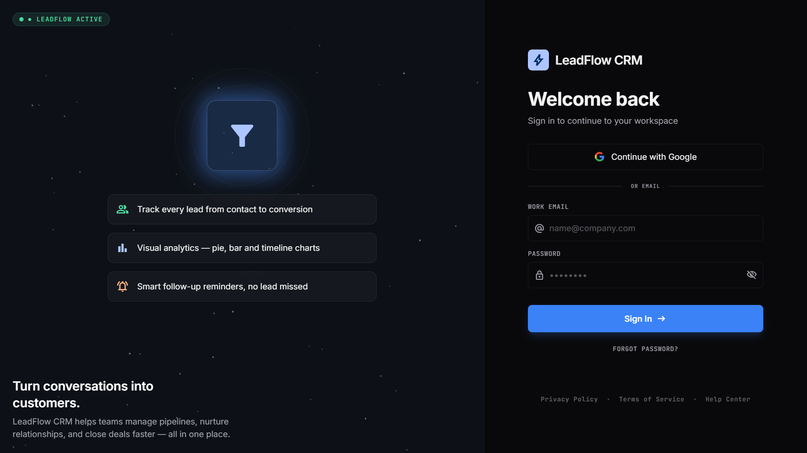
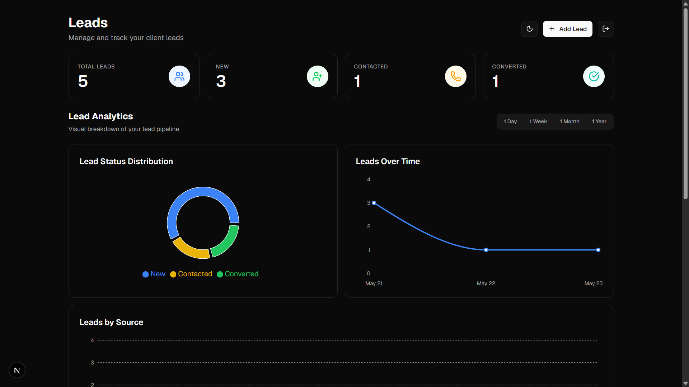
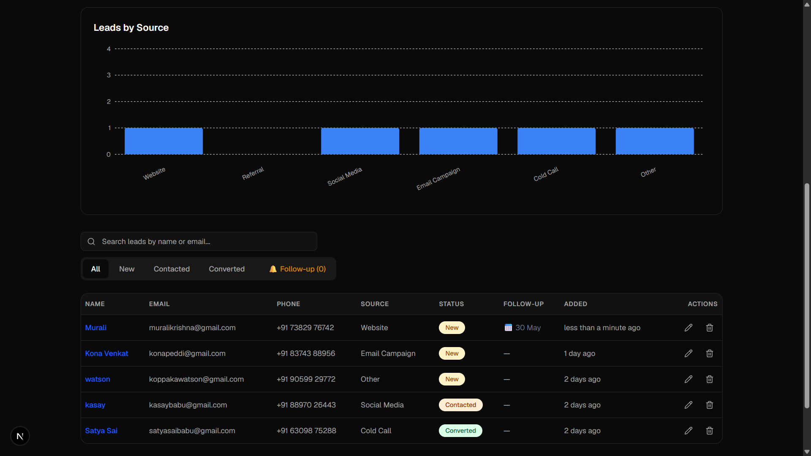

# LeadFlow CRM

> A modern, full-stack **Client Lead Management System** — built to track, manage, and convert leads with a professional-grade dashboard experience.


---

## 📸 Screenshots

| Login Page | Dashboard |
|-----------|-----------|
|  |  |  |


---

## 🛠 Tech Stack

| Layer | Technology |
|-------|------------|
| **Framework** | [Next.js 14](https://nextjs.org/) (App Router) |
| **Language** | TypeScript |
| **Styling** | Tailwind CSS v4 + Shadcn/UI |
| **Authentication** | Firebase Auth (Email/Password + Google OAuth) |
| **Database** | MongoDB Atlas (per-user dynamic collections) |
| **Charts** | Recharts |
| **Theme** | next-themes (Dark / Light / System) |
| **Icons** | Lucide React |
| **Fonts** | Geist (by Vercel) |
| **Notifications** | Radix UI Toast (via Shadcn/UI) |

---

## ✨ Features

### 🔐 Authentication
- Email/Password sign-in via a custom-designed animated HTML login page
- Google OAuth via Firebase popup — one-click sign in
- **Forgot Password** flow — 3-state UI (Login → Reset Form → Email Sent) without page reloads
- `sendPasswordResetEmail` integration — reset link sent directly to inbox
- Resend email option on the confirmation screen
- Auto-redirect to dashboard when already logged in
- Session persistence with protected routes
- Password visibility toggle

### 📋 Lead Management
- Add, edit, and delete leads with full CRUD operations
- Fields: Name, Email, Phone, Source, Status, **Follow-Up Date**, Notes
- **Duplicate email detection** — warning toast if a lead with the same email already exists
- **Lead Detail Modal** — click any lead's name to open a full popup with:
  - Complete lead info (email, phone, source, status, dates)
  - Inline status update with button group
  - Follow-up date editor with toast confirmation
  - Status timeline visualization (Created → Contacted → Converted)
  - Notes history with timestamps + add new note
- **Lead Detail Sidebar** — alternative slide-in panel with status dropdown, follow-up date picker, and notes

### 🗑️ Delete Confirmation Dialog
- Clicking delete opens a **confirmation modal** instead of deleting instantly
- Shows the lead's name: *"Are you sure you want to delete [Name]?"*
- Cancel / Delete buttons — accidental deletions fully prevented
- Close via overlay click or Escape key
- Background scroll locked while dialog is open

### 🔔 Toast Notifications
- Global toast system wired to every user action

| Action | Toast |
|--------|-------|
| Lead added | ✅ "Lead added successfully!" |
| Lead deleted | ✅ "The lead has been removed." |
| Status updated | ✅ "Status updated to [Status]" |
| Note added | ✅ "Follow-up note saved." |
| Follow-up date set | ✅ "Follow-up reminder set." |
| API error | ❌ "Something went wrong." |
| Duplicate email | ⚠️ "Lead with this email already exists!" |

### 📅 Follow-Up Reminders
- Optional **Follow-Up Date** field on every lead
- Dashboard **alert banner** for overdue or today's follow-ups
- **"View Leads →"** scrolls to table and applies the Follow-up filter automatically
- Overdue leads → red row highlight
- Today's follow-ups → amber/yellow highlight
- Dedicated **🔔 Follow-up** filter tab with live count badge

### 🔍 Real-Time Search & Filtering
- Live search by **name** or **email** as you type
- Tab filters: **All / New / Contacted / Converted / 🔔 Follow-up**
- Search + tab filters work together simultaneously
- Friendly empty state when no results match

### 📊 Lead Analytics Dashboard
- **Pie Chart** — Lead status distribution (New / Contacted / Converted)
- **Line Chart** — Leads added over time (grouped by month)
- **Bar Chart** — Leads grouped by source
- Time filter: **1 Day / 1 Week / 1 Month / 1 Year**
- All charts update live based on real lead data

### 🌙 Dark / Light Mode
- System preference detected on first load
- Manual toggle (☀️ / 🌙) in dashboard header and login page
- Theme persists across sessions via `localStorage`
- Applies to all UI: cards, table, charts, modals, toasts, dialogs

### 🔒 Per-User Data Isolation
- Each Firebase user gets their own MongoDB collection: `user_<uid>_leads`
- Zero cross-user data leakage — fully isolated by design

---

## 📁 Project Structure

```
crm/
├── app/
│   ├── api/leads/            # REST API routes (GET, POST, PATCH, DELETE)
│   ├── login/                # Login page (redirects to public/login.html)
│   ├── layout.tsx            # Root layout — ThemeProvider + LeadsProvider + Toaster
│   └── page.tsx              # Dashboard (auth-protected)
├── components/
│   ├── leads/
│   │   ├── LeadsPage         # Dashboard wrapper — scroll ref + alert banner
│   │   ├── LeadsTable        # Table — follow-up highlights + delete confirmation
│   │   ├── AddLeadModal      # Add lead form — duplicate check + toast
│   │   ├── LeadDetailModal   # Full popup — notes + status timeline + toast
│   │   ├── LeadDetailSidebar # Slide-in panel — status + notes + toast
│   │   ├── LeadStats         # KPI stat cards
│   │   └── Analytics         # Pie, Line, Bar chart components
│   └── ui/                   # Shadcn/UI + ThemeToggle + Toast + Toaster
├── hooks/
│   └── use-toast.ts          # Toast hook (global notification state)
├── lib/
│   ├── firebase.ts           # Firebase client config
│   ├── leads-context.tsx     # Global leads state + CRUD actions
│   ├── lead-model.ts         # Mongoose schema (with followUpDate)
│   └── types.ts              # Shared TypeScript types
└── public/
    ├── login.html            # Animated HTML login — Firebase CDN auth
    └── favicon.ico           # App favicon
```

---

## 🚀 Getting Started

### Prerequisites
- Node.js 18+
- A [Firebase](https://firebase.google.com/) project with Email/Password and Google auth enabled
- A [MongoDB Atlas](https://www.mongodb.com/atlas) cluster

### Installation

```bash
# 1. Clone the repository
git clone https://github.com/your-username/leadflow-crm.git
cd leadflow-crm

# 2. Install dependencies
npm install

# 3. Set up environment variables
cp .env.example .env.local
# Fill in your Firebase and MongoDB credentials

# 4. Run the development server
npm run dev
```

Open [http://localhost:3000](http://localhost:3000) to view the app.

---

## 🔑 Environment Variables

Create a `.env.local` file in the project root:

```env
# Firebase
NEXT_PUBLIC_FIREBASE_API_KEY=
NEXT_PUBLIC_FIREBASE_AUTH_DOMAIN=
NEXT_PUBLIC_FIREBASE_PROJECT_ID=
NEXT_PUBLIC_FIREBASE_STORAGE_BUCKET=
NEXT_PUBLIC_FIREBASE_MESSAGING_SENDER_ID=
NEXT_PUBLIC_FIREBASE_APP_ID=
NEXT_PUBLIC_FIREBASE_MEASUREMENT_ID=

# MongoDB Atlas
MONGODB_URI=
```


---

## 🗺️ Roadmap

- [ ] Export leads to CSV
- [ ] Conversion rate stat card
- [ ] Mobile responsive layout
- [ ] Loading skeleton screens
- [ ] Sort table columns (Name, Date, Status)
- [ ] Profile avatar with user dropdown

---

## 👨‍💻 Author

Built by **[Macherla Vijay Sampath]** as part of the Future Interns Full Stack Web Development program (2026).

- GitHub: [vijaysampath3](https://github.com/vijaysampath3)
- LinkedIn: [Vijay Sampath Macherla](https://linkedin.com/in/vijay-sampath-macherla-173729383)

---

## 📄 License

This project is open source and available under the [MIT License](LICENSE).
